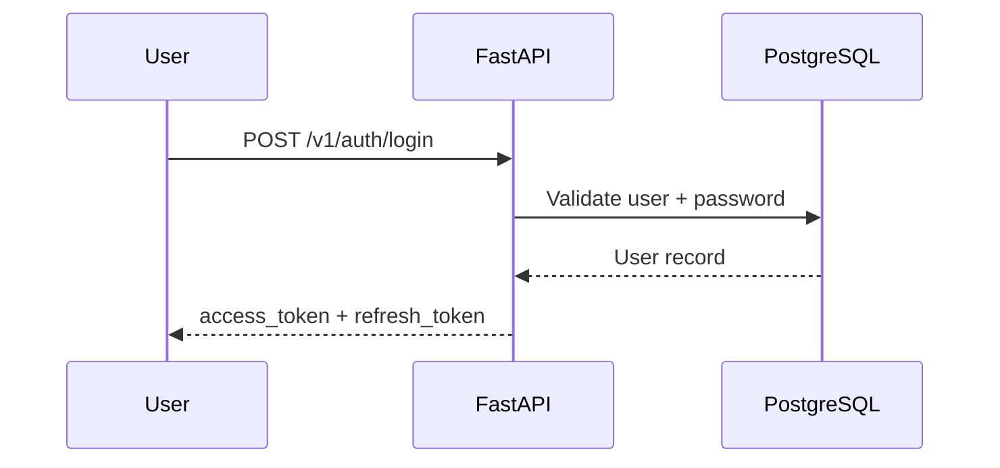
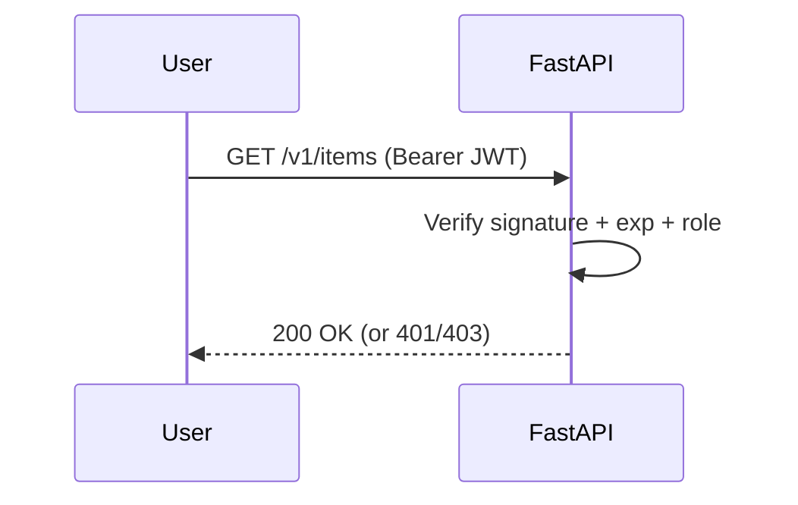
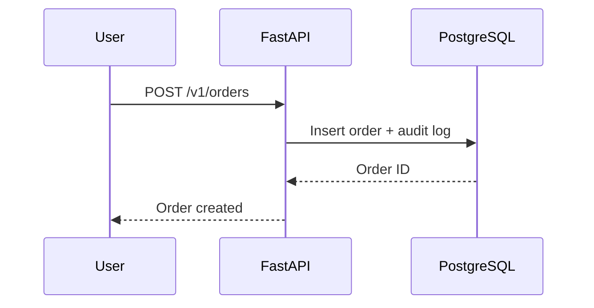
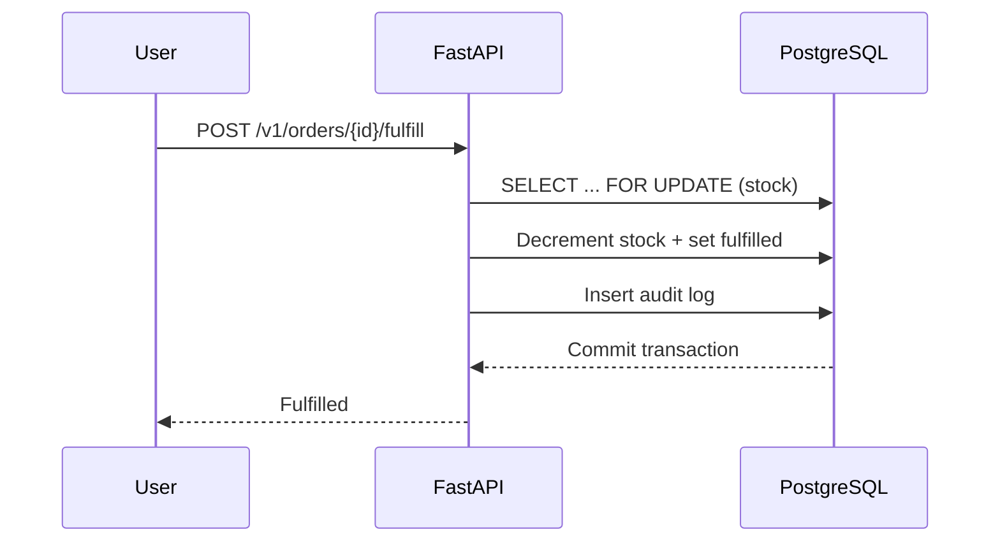

# ERPCenter Architecture

## 1) System overview and goals
ERPCenter is an API-only platform for industrial/commercial organizations with multiple branches. The system manages branches, users, stock, orders, and audit trails with security-first principles and a stateless, horizontally scalable design.

**Primary goals**
- Provide a secure, auditable inventory and order system for multiple branches.
- Enable WAN access for distributed branches.
- Support horizontal scaling without shared session state.
- Ensure consistent and transactional stock/order workflows.

## 2) Stateless vs stateful
**Stateful** systems keep user session state on the server (e.g., session storage, sticky sessions). This adds operational complexity because every server must share session state or be pinned to a single user.

**Stateless** systems require each request to be self-contained. The server validates each request without relying on stored session data.

**Why stateless here**
- **Scalability:** stateless replicas can scale horizontally without session affinity.
- **Resilience:** any instance can serve any request; no session loss on failover.
- **Security:** tokens are short-lived, verified per request, and access is scoped via roles.
- **Simplicity:** avoids session store infrastructure and cross-region replication.

## 3) High-level architecture (Mermaid)
```mermaid
flowchart LR
  Users[Branch Users] --> WAN[WAN/VPN/SD-WAN]
  WAN --> Gateway[Reverse Proxy/API Gateway (optional)]
  Gateway --> API[FastAPI Service]
  API --> DB[(PostgreSQL)]
  API --> Metrics[(Monitoring/Prometheus)]
  DB --> Backup[(Backups/Replication)]
```

## 4) Data flows (Mermaid sequence diagrams)

### Login → token issuance


### Token verification on each request


### Create order


### Fulfill order (transaction + audit)


## 5) WAN considerations
- **Latency:** endpoints are optimized for short requests; retries should use idempotent patterns.
- **TLS:** all WAN traffic should be encrypted; terminate TLS at the gateway or app.
- **Timeouts:** clients should use reasonable timeouts and exponential backoff for transient failures.
- **Connectivity model:** branches connect via VPN/SD-WAN to a central data center or cloud VPC.

## 6) Data center / infrastructure plan
- **Single node:** suitable for small deployments with periodic backups.
- **Multi-node:** scale API horizontally behind a load balancer; PostgreSQL in managed HA.
- **Scaling:** stateless API replicas scale out; no session state required.
- **Backups:** daily snapshots + PITR; periodic restore drills.
- **Replication:** read replicas for reporting and analytics.

## 7) Ethics & security
- **RBAC:** least privilege enforced per role.
- **Auditability:** all sensitive actions are logged with actor and IP.
- **Privacy:** minimize PII in logs; sensitive fields are masked.

### Threat model summary
| Threat | Mitigation |
| --- | --- |
| Credential stuffing | rate limiting at gateway, strong password policy |
| Token theft | short-lived access tokens, refresh token revocation |
| Privilege escalation | RBAC checks on every endpoint |
| Data exfiltration | network segmentation, audit logs, least privilege |
| Injection | ORM parameterization, validation schemas |

## 8) Differentiators vs spreadsheets
- Strong auditability and traceability.
- Consistent inventory rules (no negative stock unless override).
- Concurrency control with transactional fulfillment.
- Secure WAN access with stateless tokens.

## 9) Roadmap / future work
- Advanced reporting service with read replicas.
- Fine-grained permissions per resource.
- Rate limiting and anomaly detection.
- Webhook integration for ERP/BI systems.
