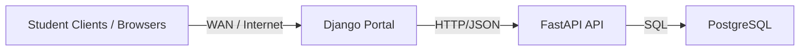

# Architecture

## High-level diagram (Mermaid)

## HTTP/JSON flow
1. A user logs into the Django portal.
2. Django sends credentials to `POST /auth/login` on FastAPI.
3. FastAPI returns a JWT token; Django stores it in the session.
4. Django calls API endpoints (items, stock, orders) using `requests` and the stored token.

## WAN considerations
- The system is modeled as **multiple clients** (student PCs) accessing a **single server PC** over a WAN-like network.
- Latency is handled by keeping requests small (JSON over HTTP) and minimizing round trips in the portal UI.
- The server PC runs Docker Compose services to keep setup consistent and portable.

## Infrastructure choices
- **Docker Compose** keeps Postgres, FastAPI, and Django consistent across machines.
- **PostgreSQL** provides a robust relational store for orders and stock.

## Security & access control
- **Token-based authentication (JWT)** via `/auth/login`.
- **RBAC (ACL)** enforced through FastAPI dependencies and roles.
- Details: see `docs/acl_rbac.md` and `docs/ethics_code.md`.

## Ethics & Security
- The project includes a short code of ethics in `docs/ethics_code.md`.
- RBAC and access rules are documented in `docs/acl_rbac.md`.

