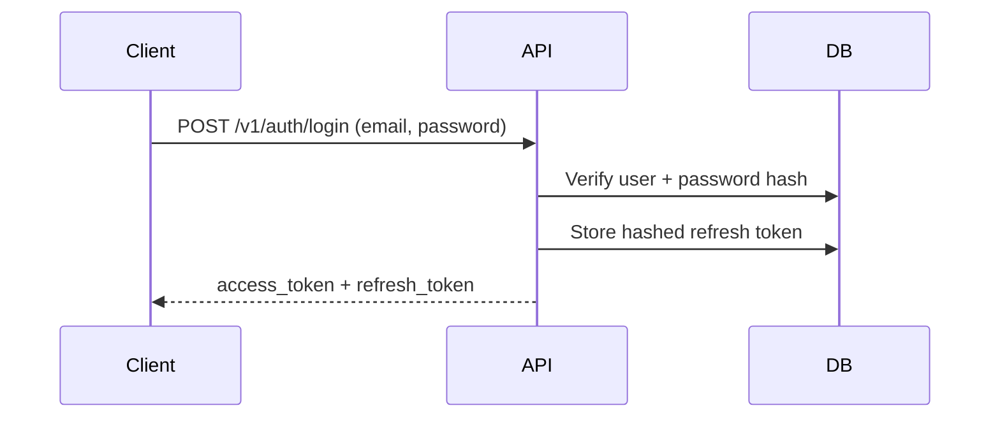
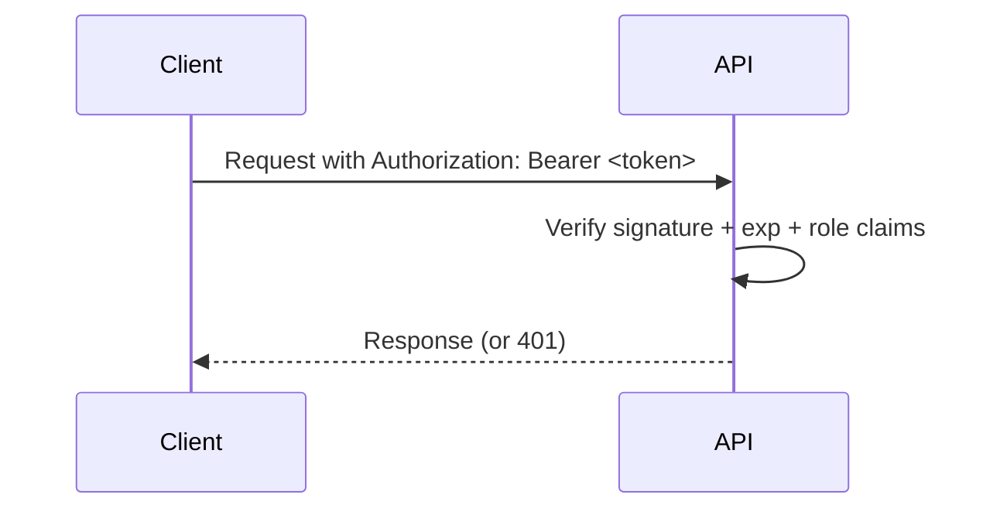
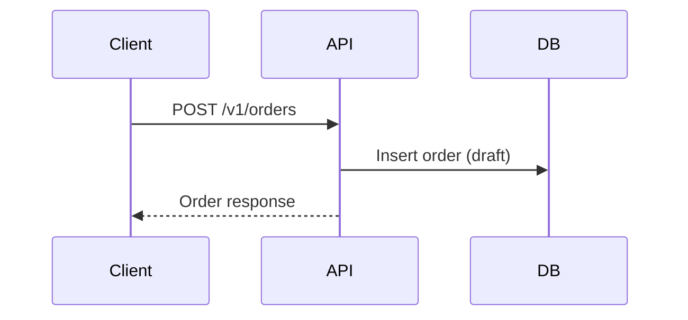
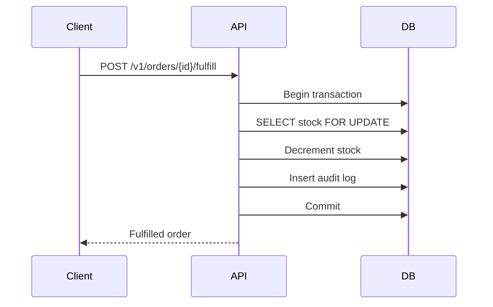

# Architecture

## 1) System overview and goals
ERPCenter is a stateless, API-only inventory and order management platform designed for multi-branch industrial operations. It prioritizes security (least-privilege RBAC, auditability), operational simplicity, and horizontal scaling across branches.

Goals:
- Consistent inventory visibility across branches
- Transactional fulfillment and stock updates
- Audit-ready trails for compliance
- Stateless, infrastructure-friendly architecture

## 2) Stateless vs. stateful
**Stateful** systems store user session data on the server (session tables, caches, or sticky sessions). This couples user identity to server instances and complicates horizontal scaling.

**Stateless** systems store all authentication context in tokens sent with each request (no server-side session). Tokens are validated on every request.

**Why stateless here:**
- **Scaling:** Any API replica can handle any request without session affinity.
- **Security:** Short-lived access tokens + revocable refresh tokens reduce blast radius.
- **Simplicity:** No server session store to maintain or secure.

## 3) High-level diagram
```mermaid
graph LR
  subgraph Branches
    UserA[Branch Users]
    UserB[Warehouse Scanners]
  end

  UserA -->|TLS/WAN/VPN| Gateway[Reverse Proxy / API Gateway (optional)]
  UserB -->|TLS/WAN/VPN| Gateway

  Gateway --> API[FastAPI Service]
  API --> DB[(PostgreSQL)]
  API --> Metrics[(Monitoring/Logs)]
  DB --> Backup[(Backups / PITR)]
```

## 4) Data flows

### Login and token issuance


### Token verification per request


### Create order


### Fulfill order (transaction + audit)


## 5) WAN considerations
- **Latency:** Requests must tolerate higher RTT; APIs use short payloads and idempotent workflows where possible.
- **Retries/Timeouts:** Clients should use exponential backoff for transient network failures.
- **TLS:** Enforce HTTPS/TLS for all WAN traffic.
- **Connectivity model:** Branches can connect via VPN/SD-WAN to the data center or cloud VPC.

## 6) Data center / infrastructure
- **Single node:** Suitable for pilot deployments; simple Docker Compose.
- **Multi-node:** Stateless API replicas behind a load balancer. PostgreSQL runs with replication and PITR.
- **Scaling strategy:** Horizontal scaling for FastAPI; DB scaled vertically + read replicas as needed.
- **Backups:** Daily full backups + PITR to mitigate data loss.

## 7) Ethics & security
- **RBAC:** Enforced on every endpoint, least privilege by role.
- **Auditability:** All stock changes and order fulfillment are logged.
- **Privacy:** Store only required PII; mask in logs.

Threat model summary:

| Threat | Mitigation |
| --- | --- |
| Token theft | Short-lived access tokens, hashed refresh tokens, TLS, no token logs |
| Privilege escalation | Strict RBAC, branch scoping for managers/workers |
| Data tampering | Transactional updates + audit logs |
| Replay | Token expiry + refresh revocation |

## 8) Differentiators
- Immutable audit trail vs. spreadsheets
- Multi-branch real-time visibility
- Transactional fulfillment with locking
- Infrastructure-ready deployment

## 9) Roadmap / future work
- Rate limiting at gateway
- Role-based reporting dashboards
- Webhooks for fulfillment events
- Multi-region disaster recovery
